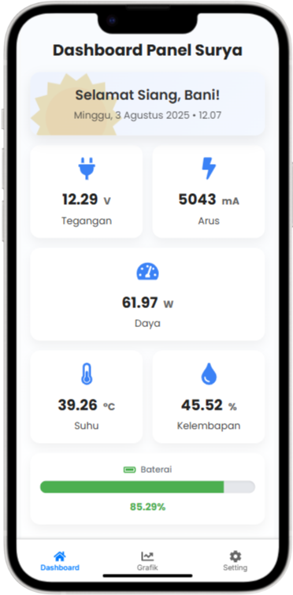

# Sunify 2.0 ☀️

**Sunify 2.0** is a web-based solar panel monitoring application. It connects IoT devices (such as microcontrollers/ESP32) to a server using the MQTT protocol, stores sensor data into a MongoDB database, and displays the data as intuitive charts via a ReactJS interface.

---

## 📋 What This App Does

1. **IoT devices** send voltage and current data to the MQTT topic `solar/data`
2. The **Flask server** listens to that topic using the `paho-mqtt` library
3. The data is automatically saved to **MongoDB**
4. The **React frontend** displays the data in:
   - **Real-time**
   - **Historical mode** (from 1 minute to 30 days back) using REST API
5. A REST API is provided for flexible data access
6. There's a backend connection test feature from the UI

---
**Dashboard Utama**
<p align="center">
  
</p>
## 🚀 Key Features

- 📡 MQTT integration in the backend: receive live data from IoT devices
- 🧠 Automatic storage into MongoDB
- 📈 Interactive charts for voltage and current
- ⏱ Real-time and historical viewing modes (1m, 15m, 1h, 6h, etc.)
- 🛠 Backend connection test from the frontend interface

---

## 🧰 Technologies Used

| Layer      | Technology                        |
|------------|-----------------------------------|
| Frontend   | ReactJS, Recharts, Chart.js       |
| Backend    | Flask, Flask-CORS                 |
| Database   | MongoDB                           |
| Messaging  | MQTT (`paho-mqtt` for Python)     |
| Timezone   | Auto-conversion to Asia/Jakarta   |

---

## 📦 How to Run This Project

### 1. Clone the Repository

```bash
git clone https://github.com/shbnmkv/Sunify-2.0.git
cd Sunify-2.0
```

### 2. Start the Backend (Flask API) 
#### Make sure !!!:
- Python is Installed
- MongoDB is running at `mongodb://localhost:27017`
- MQTT broker is active (e.g., Mosquitto on `localhost:1883`)
- MQTT topic: `solar/data`

```bash
pip install -r requirements.txt #install requirements for backend

```


#### Start the server:
```bash
python app.py
```

Backend will run at: `http://YOUR_VPS_IP:5000`

---

### 3. Start the Frontend (React)

```bash
cd frontend
npm install
npm start
```

Frontend will run at: `http://YOUR_VPS_IP:3000`

---

## 🔌 REST API Endpoints

| Endpoint                                | Method | Description                                 |
|-----------------------------------------|--------|---------------------------------------------|
| `/api/latest`                           | GET    | Fetch the latest sensor data                |
| `/api/history?range=15m`                | GET    | Fetch historical data based on preset time  |
| `/api/history_range?start=...&end=...`  | GET    | Fetch data between a specific time range    |
| `/api/ping`                             | GET    | Check if the backend is alive               |

---

## 📂 Project Structure

```
Sunify-2.0/
├── app.py                # Main backend (Flask + MQTT + MongoDB)
├── requirements.txt      # Python dependencies
├── frontend/             # React frontend
└── README.md             # Project documentation

```

---


##  🔧 Usage
To connect the front end with the back end, go to the Settings page on the web app.
Then, enter the IP address of the VPS running the backend along with the port it uses.

You can test the connection using the Test Connection feature provided in the interface.